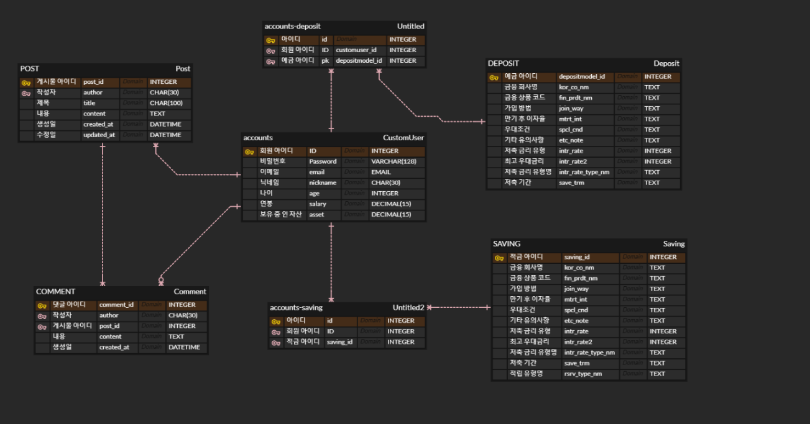

#  프로젝트 개요
- 설명 : 금융 상품 비교 애플리케이션
- 기간 : 2024.11.18(월) ~ 2024.11.26(화)

  

# 주요 기능

  1. 예적금 금리에 따른 비교

  2. 맵을 통한 은행 위치 검색 및 실시간 현재 위치 기반 근처 은행 리스트

  3. AI 챗봇을 활용한 금융 상품추천

  4. 실시간 환율 계산기

  5. 마음에 드는 금융 상품 저장하기

  6. 저장한 금융 상품들의 금리 시각화
  
  7. 소통 게시판
  
  # ERD
  

 

## 🛒 기술 스택

### Backend
&nbsp;
&nbsp;
&nbsp;

### Frontend
&nbsp;

### DevOps
&nbsp;
&nbsp;

### Tools
&nbsp;
&nbsp;
&nbsp;

 

 

## 🔧 개발 환경

**Backend**
- django 4.2.4

**Frontend**
- vue.js 3.3.4

 

# 프로젝트  진행과정

## 1 일차 (11.18)
  - 사이트 전체 기획 및 ERD 작성
  - 컴포넌트 구조 생성
  - django model 구축
  - 업무 분담 및 메인 페이지 기본 틀 구현

## 2 일차 (11.19)
  - KAKAO API를 활용한 지도 검색 시스템 구현
  - 한국 수출입 은행 API를 활용한 환율 계산기 구현
  - 회원 관리 기능: Django-rest-auth 를 활용환 기본 회원 관리 API구현
                   costum user 메서드 및 serilaizer 구현
  - 커뮤니티 기능: 게시물, 댓글 CRUD 함수 및 vue 작성

## 3 일차 (11.20)
  - 상품 저장을 위한 fin 모델 구축, 중계 모델 생성
  - 예, 적금 검색 기능 구현
  - 회원 가입, 로그인 페이지 구현
  - 게시판 페이지 구현

## 4 일차 (11.21)
  - 회원 탈퇴, 정보 수정 기능 구현 및 페이지 생성
  - 저장한 상품 정보 기능 구현
  - GPT API를 활용한 쳇봇 기능 구현
  - 예, 적금 디테일 페이지에 저장 기능 구현

## 5 일차 (11.22)
  - 홈페이지 배경화면에 동영상 삽입
  - 나의 정보에서 저장 상품 페이지 분할
  - 쳇봇에 금융 상품 추천 프롬프트 적용

## 6 일차 (11.25)
  - 홈페이지 디자인 통일
  - 저장 상품들의 금리를 비교하여 그래프로 시각화
  - 사이트 전반적인 css 세부사항 조정